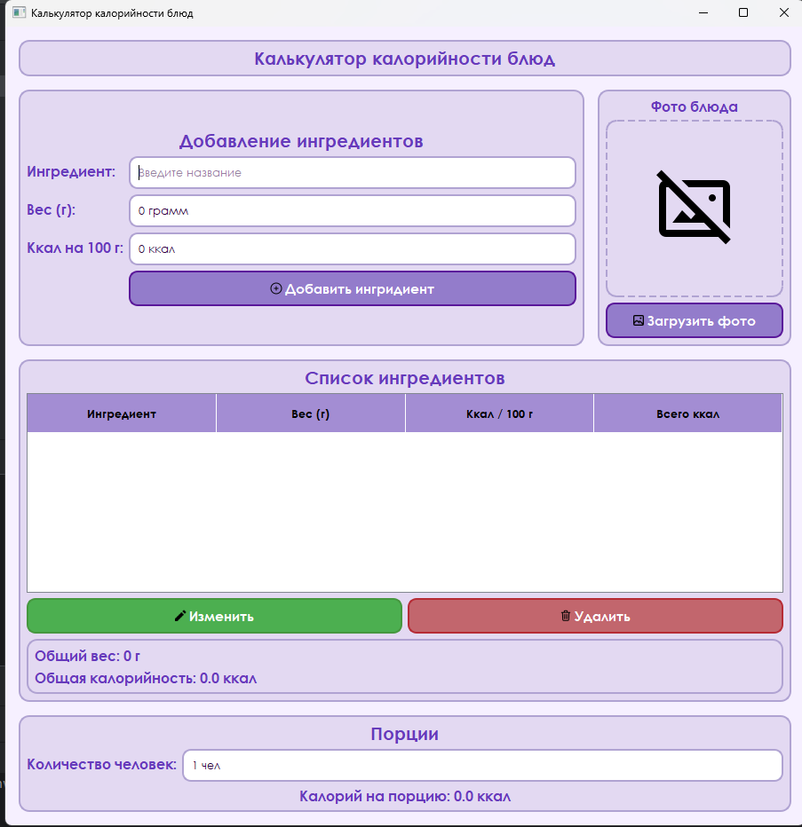

# Приложение "Калькулятор калорийности блюд"

## Описание приложения
**Калькулятор калорийности рецептов** — настольное приложение, разработанное на языке Python с использованием библиотеки PyQt5 и базы данных SQLite.

Приложение позволяет добавлять ингредиенты, рассчитывать общую калорийность блюда, калорийность на одну порцию, а также сохранять список ингредиентов в базе данных.

# Запуск проекта 
1. Создайте виртуальное окружение: `python -m venv venv` 
2. Активируйте:  - Windows: `venv\Scripts\activate` - macOS/Linux: `source venv/bin/activate` 
3. Установите зависимости: `pip install PyQT5` 
4. Запустите: `python main.py`

# Возможности приложения

1. Добавление ингредиентов.
2. Изменение ингредиентов.
3. Удаление ингредиентов.
4. Автоматические расчёт калорий.
5. Расчет калорий на порцию / человека.
6. Сохранение данных в SQLite.
7. Загрузка фотографий блюда.
8. Красивый интерфейс.

# Структура проекта
1. main.py (точка входа приложения)
2. ui_main.py (интерфес приложения, обработка событий, расчёт калорий, взаимодействие с БД)
3. database.py (создание БД, добавление, изменение, удаление, получение данных)
4. calculator.ui (интерфейс Qt Designer)
5. style.qss (стили оформления приложения)
6. recipes.db (база данных SQLite)
7. images/ (иконки приложения)
8. README.md (документация проекта)

# Используемые библиотеки / программы
- Python
- Pycharm
- Pyqt5
- SQLite3
- Qt Designer
- QSS

# Как пользоваться
1. Введите название ингредиента.
2. Укажите вес в граммах.
3. Укажите калорийность продукта на 100 грамм.
4. Нажмите "Добавить".
5. При необходимости выберите фотографию блюда.
6. Укажите количество порций.
7. После этого программа автоматические расчитает: общий вес; общуя калорийность; калорийность на порцию.

# Тест - план
1. Добавление ингридиента - Ингридиент появляется в таблице.
2. Редактирование - Данные изменяются.
3. Удаление - Ингридиент удаляется.
4. Расчёт калорий - Расчёт калорий выполняется корректно.
5. Расчёт на порци - Показывается точное значение
6. Загрузка фотографии - Фотография отображается
7. Перезапуск программы - Данные загружаются из БД SQLite.

# Демонстрация
## Главное окно программы

# Контакты
Автор: Мамутин Илья Александрович

Группа: ФМ-14-25

# Лицензия
Проект разработан в учебных целях.

    
