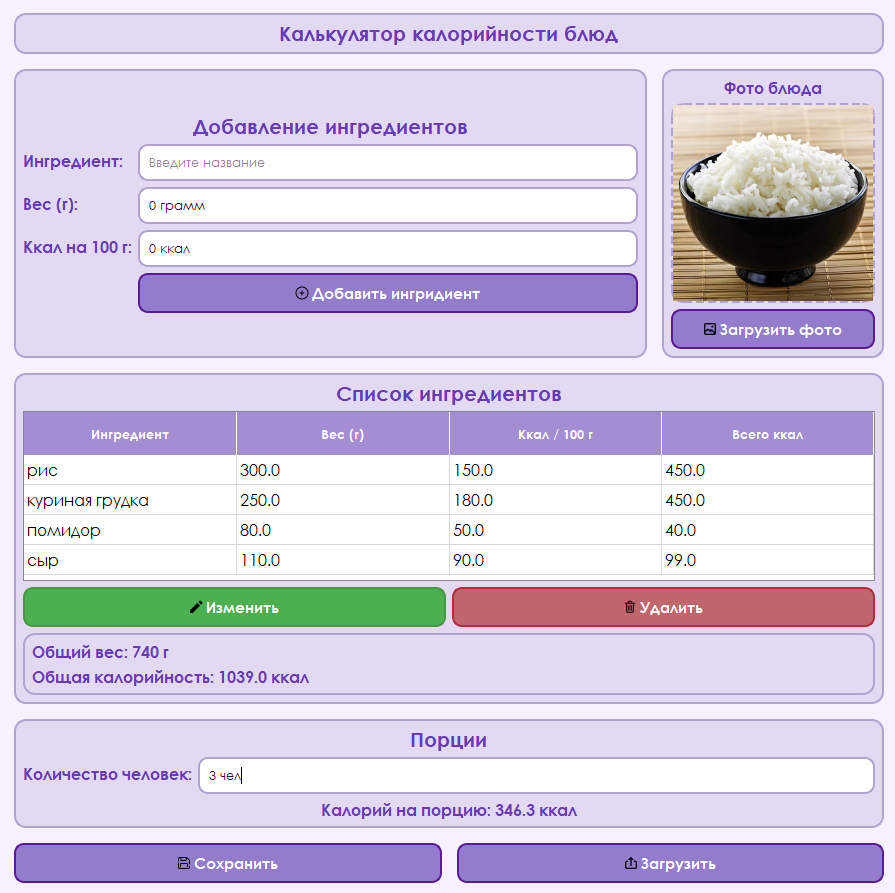
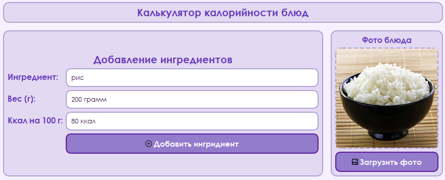
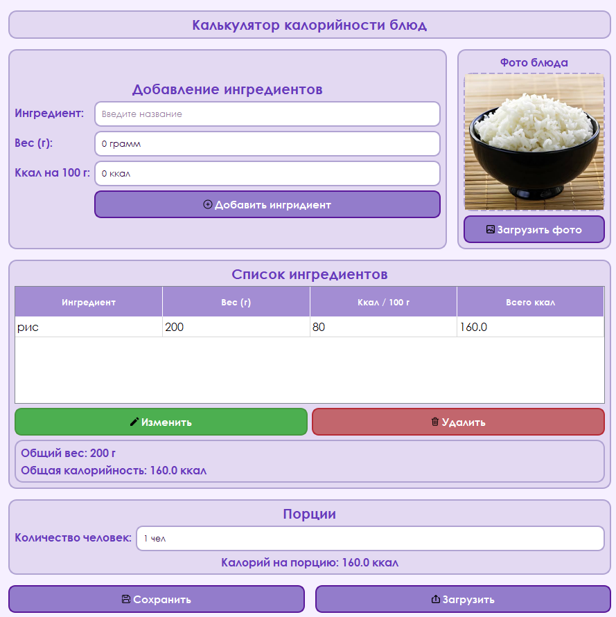
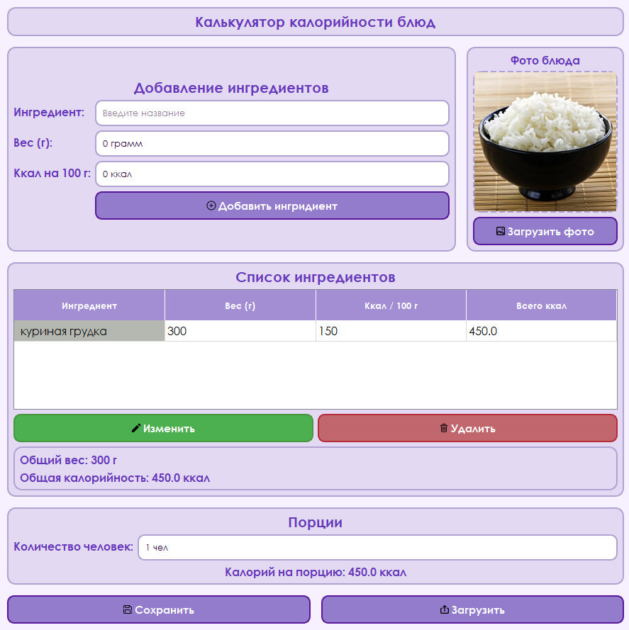
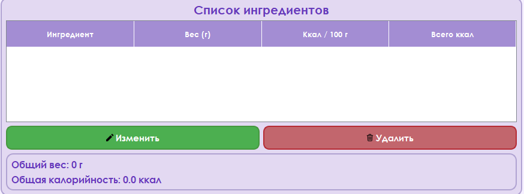
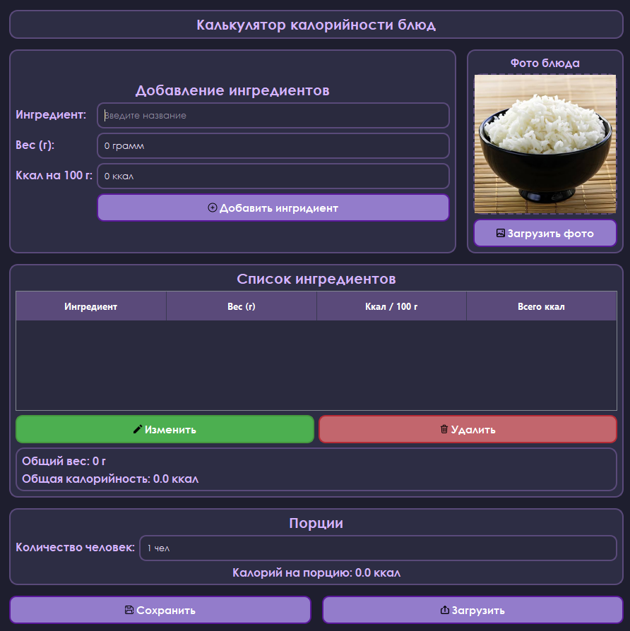

# Приложение "Калькулятор калорийности блюд"

## Описание приложения
**Калькулятор калорийности рецептов** — настольное приложение, разработанное на языке Python с использованием библиотеки PyQt5 и базы данных SQLite.

Приложение позволяет добавлять ингредиенты, рассчитывать общую калорийность блюда, калорийность на одну порцию, сохранять список ингредиентов в базе данных, загружать фотографии блюд, экспортировать и импортировать данные в форматах CSV и JSON, а также переключаться между светлой и тёмной темами оформления.

## Запуск проекта 
1. Создайте виртуальное окружение: `python -m venv venv` 
2. Активируйте:  - Windows: `venv\Scripts\activate` - macOS/Linux: `source venv/bin/activate` 
3. Установите зависимости: `pip install PyQT5` 
4. Запустите: `python main.py`

## Возможности приложения
1. Добавление ингредиентов с указанием веса и калорийности.
2. Редактирование добавленных ингредиентов.
3. Удаление ингредиентов из списка.
4. Автоматический расчёт общей калорийности блюда.
5. Расчёт калорийности на одну порцию (с учётом количества человек).
6. Сохранение данных в базе данных SQLite.
7. Загрузка и сохранение фотографии блюда между запусками.
8. Красивый интерфейс с закруглёнными элементами.
9. Переключение между светлой и тёмной темами (с сохранением выбора).
10. Экспорт списка ингредиентов в CSV или JSON.
11. Импорт списка ингредиентов из CSV или JSON.
12. Поддержка горячих клавиш для быстрого управления.
13. Автоматический сброс настроек при удалении базы данных.

## Горячие клавиши
1. 'Enter' - Добавить игредиент
2. 'Backspace' - Удалить выбранный игредиент
3. 'Ctrl + T' - Переключение темы (тёмная/светлая)

## Структура проекта
1. main.py (точка входа приложения)
2. ui_main.py (интерфес приложения, обработка событий, расчёт калорий, взаимодействие с БД)
3. database.py (создание БД, добавление, изменение, удаление, получение данных)
4. calculator.ui (интерфейс Qt Designer)
5. style.qss (стили оформления приложения)
6. style_dark.qss
7. recipes.db (база данных SQLite)
8. images/ (иконки приложения)
9. README.md (документация проекта)

## Используемые библиотеки / программы
- Python
- Pycharm
- Pyqt5
- SQLite3
- Qt Designer
- QSS
- CSV, JSON

## Как пользоваться
1. Введите название ингредиента в поле «Ингредиент».
2. Укажите вес продукта в граммах.
3. Укажите калорийность продукта на 100 грамм.
4. Нажмите кнопку **«Добавить ингредиент»** или клавишу `Enter`.
5. При необходимости загрузите фотографию блюда кнопкой **«Загрузить фото»**.
6. Укажите количество порций в разделе «Порции».
7. Программа автоматически рассчитает:
   - Общий вес блюда
   - Общую калорийность
   - Калорийность на одну порцию
8. Для редактирования ингредиента — выберите его в таблице, измените данные и нажмите **«Изменить»**.
9. Для удаления — выберите строку и нажмите **«Удалить»** или клавишу `Backspace`.
10. Для сохранения рецепта в файл — нажмите **«Сохранить»**.
11. Для загрузки рецепта из файла — нажмите **«Загрузить»**.
12. Для смены темы используйте сочетание клавиш `Ctrl + T`.

## Тест - план
1. Добавление ингридиента - Ингридиент появляется в таблице.
2. Редактирование - Данные изменяются.
3. Удаление - Ингридиент удаляется.
4. Расчёт калорий - Расчёт калорий выполняется корректно.
5. Расчёт на порцию - Показывается точное значение
6. Загрузка фотографии - Фотография отображается
7. Сохранение фото между запусками - Фото загружается автоматически при следующем запуске
8. Перезапуск программы - Данные загружаются из БД SQLite.
9. Смена темы с помощью сочетания клавиш - Тема меняется.
10. Экспорт в CSV/JSON - Файл создаётся с корректными данными.
11. Импорт из CSV/JSON - Ингредиенты добавляются в таблицу.
12. Удаление recipes.db - Сбрасываются все настройки программы.

## Демонстрация
### Главное окно программы

### Загрузка фото

### Редактирование, добавление, удаление ингредиента

- добавление 

- редактирование

Нажмите в таблице на продукт, который хотите изменить, после этого в блоке **"Добавление игредиентов"** пишите новые данные.

- удаление

Нажмите в таблице на продукт, который хотите удалить, после этого нажмите на клавишу `Backspace` или кнопку **"Удалить"**.

- смена темы (Ctrl + T)

## Контакты

**Автор:** Мамутин Илья Александрович

**Группа:** ФМ-14-25

## Лицензия
Проект разработан в учебных целях.

    
